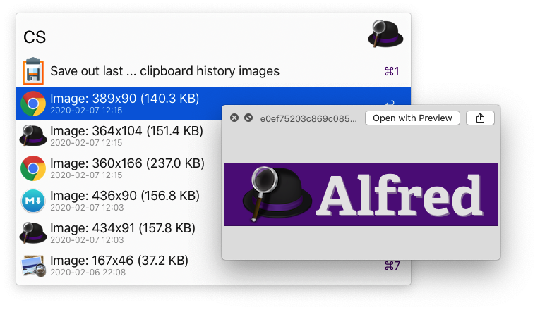

# ClipSaver (v1.0.3)

This workflow has two modes and is triggered by the `cs` keyword by default.

Mode 1 presents the images from the clipboard history via a Script Filter, and allows selecting one image to be extracted, converted to PNG (Alfred saves them as .tiff) and placed in a folder of your choosing (default is on the Desktop, in a folder called `saved_clips`)

Mode 2 accepts an integer (N) and will recursively save the last N images to the designated folder.

Both modes will remove the clipboard entry as well as the .tiff from Alfred's database upon successful conversion.

## Workflow Variables

- `db_name` defaults to `clipboard.alfdb` (required)
- `db_path` defaults to `Library/Application Support/Alfred/Databases` (required)
- `dest_dir` defaults to `Desktop/saved_clips` (required)
- `sf_clip_limit` (default: empty) you can optionally specify a limit to constrain the number of results displayed in the Script Filter

## Usage Tips

- Tap `SHIFT` while navigating through Script Filter results to get a QuickLook preview of the image. While QL is displayed, you can use the Arrow keys to flip through results.
- This makes use of the JSON `match` property so you can filter the results by the name of the App from which it was captured. E.g. with `cs chrome` you'll see only images from Google Chrome.

This workflow should not require any dependencies, but was only tested on macOS 10.15.3 + Alfred 4.0.8.1135.

## Screenshot:

## Download:
https://github.com/luckman212/alfredworkflows/blob/master/ClipSaver.alfredworkflow?raw=true

## Forum topic:
https://www.alfredforum.com/topic/14400-clipsaver-save-images-from-clipboard-history-to-png-files/
